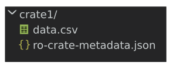

::::::::::::::::::::::::::::::::::::::: objectives
- Creating a skeleton RO-Crate Metadata File
- Use the JSON-LD pre-amble to enable Linked Data
::::::::::::::::::::::::::::::::::::::::::::::::::

:::::::::::::::::::::::::::::::::::::::: questions
- How can I start a new RO-Crate?
::::::::::::::::::::::::::::::::::::::::::::::::::


## Turning a folder into an RO-Crate

In the simplest form, to describe some data on disk,
an _RO-Crate Metadata File_ is placed in a folder
alongside a set of files or folders. 

First create a new folder `crate1/`
and add a single file `data.csv` to represent our dataset:

```
"Date","Minimum temperature (°C)","Maximum temperature (°C)","Rainfall (mm)"
2022-02-01,16.0,28.4,0.6
2022-02-02,16.3,17.2,12.4
```


Next, to turn this folder into an RO-Crate,
we need to add the _RO-Crate Metadata File_, which has a fixed filename.
Create the file `ro-crate-metadata.json`
using [Visual Studio Code](https://code.visualstudio.com/) or your favourite editor,
then add the following JSON:

```json
{
  "@context": "https://w3id.org/ro/crate/1.1/context",
  "@graph": [

  ]
}
```

Your folder should now look like this:

{alt='Any folder can be made into an RO-Crate by adding `ro-crate-metadata.json`'}

The presence of the reserved `ro-crate-metadata.json` filename
means that `crate1` (and its children) can now be considered to be an **RO-Crate**.
We call the top-level folder of the crate for the **RO-Crate Root**
and can now refer to its content with relative file paths.

We also need to make some declaration within the JSON file to turn it into a valid _RO-Crate Metadata Document_,
explained in the next session.


## JSON-LD preamble

The preamble of `@context` and `@graph` are JSON-LD structures
that help provide global identifiers to the JSON keys and types
used in the rest of the RO-Crate document.
These will largely map to definitions in the [schema.org](http://schema.org/) vocabulary,
which can be used by RO-Crate extensions to provide additional metadata beyond the RO-Crate specifications.
It is this feature of JSON-LD that helps make RO-Crate extensible for many different purposes
-- this is explored further in the specification's [appendix on JSON-LD](https://www.researchobject.org/ro-crate/1.1/appendix/jsonld.html).
In short, only JSON keys (_properties_) and types defined this way can be used within the RO-Crate Metadata Document.

However, in the general case it should be sufficient to follow the RO-Crate JSON examples directly without deeper JSON-LD understanding.
The RO-Crate Metadata Document contains a flat list of _entities_ as JSON objects in the `@graph` array.
These entities are cross-referenced using `@id` identifiers, rather than being deeply nested.
This is one major difference from JSON structures you may have experienced before.
The `@type` keyword associates an object with a predefined type from the JSON-LD context.
Almost any property can alternatively be used with an `[]` array to provide multiple values.

The rest of this tutorial,
and indeed most of the [RO-Crate specification](https://www.researchobject.org/ro-crate/1.1/),
specify which entities can be added to the `@graph` array. 


:::::::::::::::::::::::::::::::::::::::: keypoints
- Adding a RO-Crate Metadata file to a folder turns it into an RO-Crate
- The RO-Crate Root is the top-level folder of the crate
- RO-Crate uses schema.org as base vocabulary
- The JSON-LD context enables optional Linked Data processing
- Descriptions are listed flatly as entities in the @graph array
::::::::::::::::::::::::::::::::::::::::::::::::::

